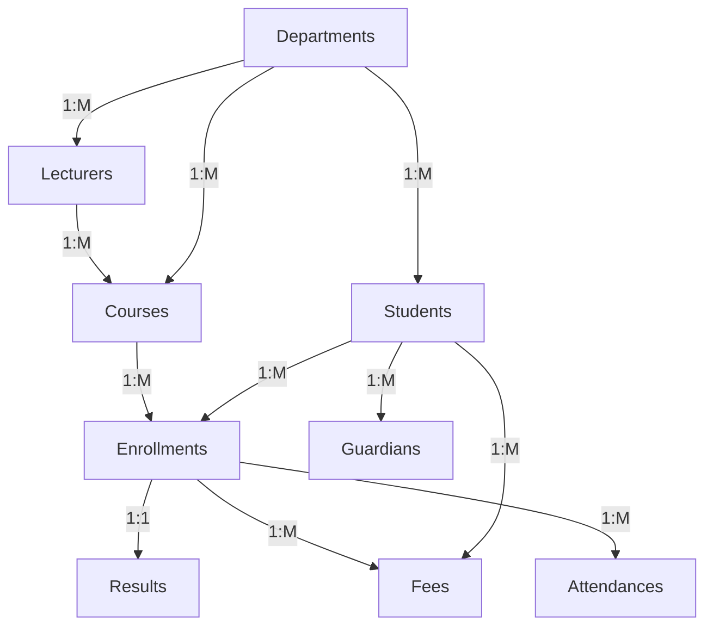

# Design Document

By Uchebuaku Wisdom

Video overview: https://youtu.be/wYXOsCM5wxE
---

## Scope

### Purpose
The purpose of this database is to manage school activities such as student records, lecturers, departments, courses, enrollments, results, attendance, fees, and guardians’ information.

### In Scope
The database includes:
- Student management.
- Lecturer management.
- Department management.
- Course management.
- Enrollments.
- Results and grading.
- Attendance records.
- Fee payments.
- Guardian information.

### Out of Scope
- Library management.
- Timetable scheduling.
- Online learning system.
- Payroll system.

---

## Functional Requirements

### User Capabilities
- Add, update, and delete records
- Enroll students into courses
- Record student results
- Track attendance
- Manage fee payments
- Retrieve student information and reports

### Beyond Scope
- Geographic proximity searches or mapping functionality.
- Advanced analytics, such as most-used contact methods.
- Bulk import/export or synchronization with third-party apps.

---

## Representation

### Entities

1. **Departments**
   - Attributes:
     - department_id (Primary Key, INTEGER, AUTO_INCREMENT)
     - department_name (TEXT, NOT NULL)
     - office_location (TEXT, NOT NULL)
   - Stores department information.

2. **Lecturers**
   - Attributes:
     - lecturer_id (Primary Key, INTEGER, AUTO_INCREMENT)
     - first_name (TEXT, NOT NULL)
     - last_name (TEXT, NOT NULL)
     - email (TEXT, UNIQUE)
     - phone_number (TEXT, UNIQUE)
     - department_id (Foreign Key)
     - hire_date (TEXT)
   - Stores lecturer information.
3. **Students**
   - Attributes:
     - student_id (Primary Key, INTEGER, AUTO_INCREMENT)
     - first_name (TEXT, NOT NULL)
     - last_name (TEXT, NOT NULL)
     - gender (TEXT)
     - date_of_birth (TEXT)
     - email (TEXT, UNIQUE)
     - phone_number (TEXT, UNIQUE)
     - home_address (TEXT)
     - department_id (Foreign Key)
     - admission_date (TEXT)
     - matric_number (TEXT, UNIQUE)
   - Stores student personal and academic information.

4. **Courses**
   - Attributes:
     - course_id (Primary Key, INTEGER, AUTO_INCREMENT)
     - course_ti tle (TEXT, UNIQUE)
     - course_code (TEXT, UNIQUE)
     - credit_unit (INTEGER)
     - department_id (Foreign Key)
     - lecturer_id (Foreign Key)
   - Stores all available courses and their assigned lecturers.

5. **Enrollments**
   - Attributes:
     - enrollment_id (Primary Key, INTEGER, AUTO_INCREMENT)
     - student_id (Foreign Key)
     - course_id (Foreign Key)
     - semester (TEXT)
     - session (TEXT)
     - enrollment_date (TEXT)
   - Tracks the courses students register for each semester and session.

6. **Results**
   - Attributes:
     - result_id (Primary Key, INTEGER, AUTO_INCREMENT)
     - enrollment_id (Foreign Key, UNIQUE)
     - score (INTEGER)
     - grade (Generated Column)
     - remark (Generated Column)
   - Stores students’ examination scores, grades, and remarks.

7. **Attendances**
   - Attributes:
     - attendance_id (Primary Key, INTEGER, AUTO_INCREMENT)
     - enrollment_id (Foreign Key)
     - attendance_date (TEXT)
     - attendance_status (TEXT)
   - Tracks students’ attendance records for enrolled courses.

8. **Fees**
   - Attributes:
     - payment_id (Primary Key, INTEGER, AUTO_INCREMENT)
     - student_id (Foreign Key)
     - enrollment_id (Foreign Key)
     - amount_paid (NUMERIC)
     - payment_date (TEXT)
     - payment_method (TEXT
   - Stores students’ school fee payment records.

9. **Guardians**
   - Attributes:
     - guardian_id (Primary Key, INTEGER, AUTO_INCREMENT)
     - student_id (Foreign Key)
     - guardian_name (TEXT)
     - relationship (TEXT)
     - phone_number (TEXT)
     - home_address (TEXT)
   - Stores guardian or parent information linked to students.

---

### Relationships

- **One-to-Many**:
  - One department can have many students, lecturers and courses.
  - One lecturer can teach many courses.
  - One student can have many enrollments,fee payments.
  - One course can have many enrollments.
  - One enrollment can have many attendance records.

- **One-to-One**:
  - One enrollment can have only one result.

- **Entity Relationship Diagram**:

### Optimizations

* Indexes:
    Indexes were added to improve query performance on commonly searched columns:
    department_name, course_code, student names, lecturer names, score, grade, attendance_status, guardian_name, amount_paid.
    These indexes improve JOIN operations and search speed

* Normalization:
    he database follows Third Normal Form (3NF) to Eliminates duplicate data, Reduces redundancy, Improves consistency and Ensures better relational integrity.

* Constraints and Data Integrity:
    The database uses several constraints to maintain data accuracy: PRIMARY KEY, FOREIGN KEY, UNIQUE, CHECK, NOT NULL, GENERATED ALWAYS AS, and ON DELETE CASCADE.
    Examples: Emails must be unique, Scores must be between 0 and 100, Gender must be Male or Female, Payment amount must be greater than 0 and Attendance status must be Present or Absent.

* Normalization:
    The database includes several SQL views to simplify reporting: v_student_courses, v_student_results, v_department_student_count, v_student_fee_payments, v_student_guardians, v_student_enrollments, v_student_attendance and v_students_courses_lecturers.
    These views reduce query complexity and improve readability.

### Limitations

* Scalability:
    The database is suitable for small and medium-sized institutions. Large-scale institutions may require additional optimization and partitioning.

* Security:
    The current design does not include: User authentication, Role-based access control, and Encryption mechanisms.

* Advanced Features:
   The database does not support: Online result checking, Automated GPA/CGPA computation, Timetable scheduling, Real-time notifications and Mobile or web application integration.
